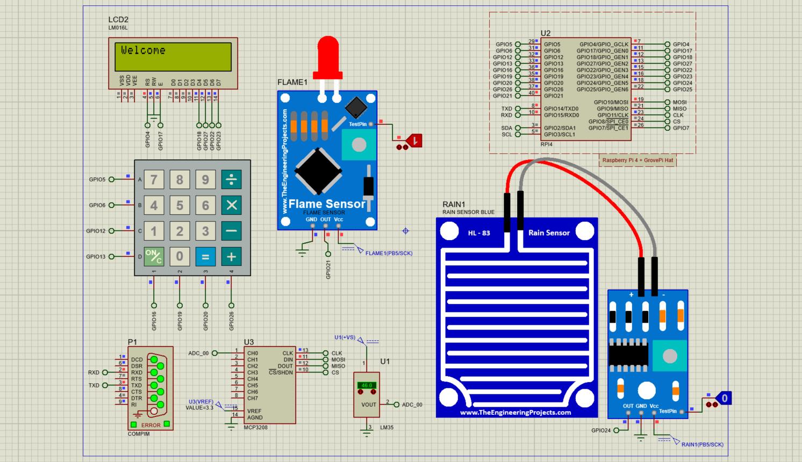
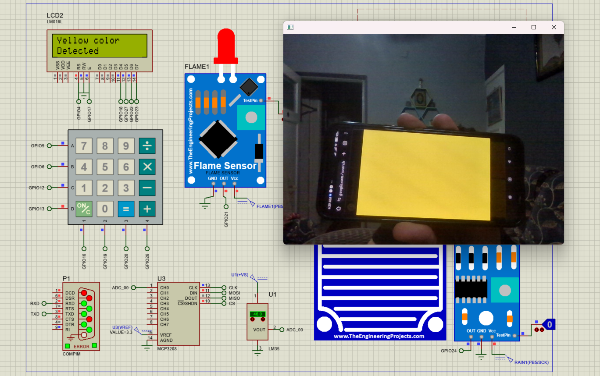

<h1 align = center style ="margin-bottom:40px"> greenhouse-monitoring-system </h1>

## Overview

This project presents a simulated greenhouse monitoring system implemented using Raspberry Pi interfaced with three sensors—temperature, rain, and flame—within the Proteus simulation environment. The system includes password protection for access and integrates OpenCV for leaf color analysis using a camera module, with results displayed on an LCD

## Features

- Temperature Monitoring: Monitors the ambient temperature within the greenhouse to maintain optimal growing conditions.
- Rain Sensing: Detects rainfall to facilitate timely adjustments to irrigation systems.
- Flame Detection: Identifies potential fire hazards within the greenhouse for rapid response.
- Secure Access: Requires a password for access to the system, ensuring security and preventing unauthorized usage.
- Leaf Color Analysis: Utilizes OpenCV to analyze leaf color for assessing plant health.
- Real-time Display: Displays processed data, including temperature, rainfall status, flame detection, and leaf color analysis results, on an LCD screen.
- Secured system : uses passwork to monetoring the sensors and able to logout

# Simulation Environment

The project is simulated using the Proteus 8 simulation environment, providing a virtual greenhouse environment to replicate real-world conditions, and used visual serial port emulator to access the port and run external python code to detect the color from the integrated camera.

## Getting Started

To run the simulation, follow these steps:

1. Clone this repository to your local machine.
2. Install Proteus simulation software if not already installed.
3. Open the project in Proteus `Final_ISA.pdsprj`.
4. Configure the Raspberry Pi and sensors according to the provided schematic.
5. Open python code `myserial.py`.
6. Run visual serial port emulator on detected port `COM1`
7. Run python code then start running the simulator

## Dependencies
- Proteus Simulation Software
- Python 3
- Raspberry Pi GPIO Libraries
- OpenCV Library